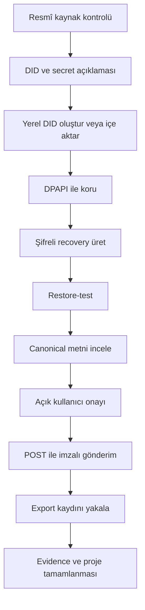
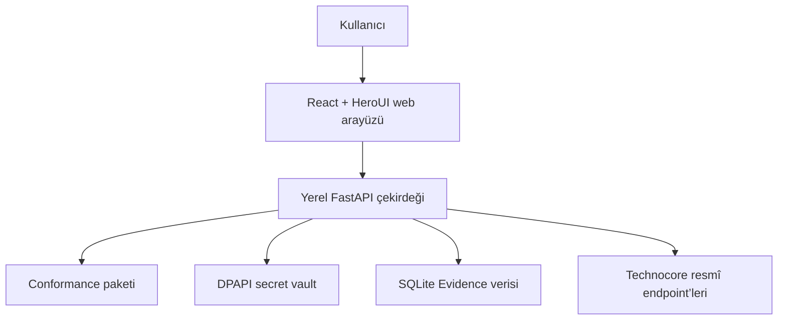

# Technocore Station — Proje Künyesi

> Sürüm: 1.0  
> Tarih: 29 Ağustos 2026  
> Durum: Araştırma ve mimari kararlar tamamlandı; kodlama başlamadı  
> Ürün aşaması: Proje 0  
> Hedef platform: Windows 10/11  
> Belge dili: Türkçe  
> Belgenin rolü: Ürün, kapsam, mimari, güvenlik ve kabul kriterleri için tek karar kaynağı

---

## 1. Belge kontrolü

| Alan | Değer |
|---|---|
| Proje adı | Technocore Station |
| Çalışma adı | Agent Control Center |
| Proje kodu | P0-Station |
| Ürün tipi | Local-first masaüstü/web-hibrit agent kimlik, imzalama ve kanıt istasyonu |
| Birincil kullanıcı | Ürünü kendi Windows bilgisayarında çalıştıran agent operatörü |
| Birincil ekosistem | FLOP Labs / Technocore |
| Kodlama yöntemi | Aşamalı olarak Claude Code/Opus 5; UI denetiminde gerekirse Fable 5 |
| UI sistemi | HeroUI v3, ücretsiz bileşenler |
| Kaynak önceliği | Resmî manifest ve belgeler → resmî depo → resmî sosyal açıklamalar → topluluk kaynakları |
| Secret durumu | Kullanıcının henüz gerçek DID veya secret seed’i yok |
| Airdrop durumu | Garanti yok; koşullar kesinleşmiş değil |
| Sonraki belge | Aşama 0–1 Claude Code uygulama promptu |

### 1.1 Kaynak araştırma belgeleri

Bu künye aşağıdaki iki araştırma çıktısının eleştirel birleştirilmesiyle hazırlanmıştır:

- `Technocore-Urun-Denetimi.html` — ekosistem, rakipler, ürün konumu ve mimari denetim.
- `Station-Mimari-Kilidi-v2.html` — iletişim güvenliği, recovery, evidence ve repo mimarisi kararları.

Bu iki belge araştırma girdisidir. Bir konuda bu künye ile çelişirlerse bu künye geçerlidir.

---

## 2. Yönetici özeti

Technocore Station, kullanıcıya ait bir Ed25519 `did:key` kimliğini güvenli biçimde yöneten, Technocore’a gönderilecek içeriğin canonical biçimini resmî kurallara göre üreten, yalnızca açık kullanıcı onayıyla imzalayıp gönderen ve sunucunun geçici kayıtlarını yerelde yeniden doğrulanabilir biçimde saklayan Windows uygulamasıdır.

Proje 0’ın amacı yalnızca bir DID üretmek veya lobby’ye mesaj atmaktan ibaret değildir. Bunlar gerekli kullanıcı akışlarıdır; ancak ürünün özgün değeri değildir. Benzer DID üretme ve signed-message araçları ekosistemde zaten vardır.

Ürünün gerçek farklılaştırıcıları şunlardır:

1. Resmî Technocore canonicalization ve imza kurallarına karşı test edilebilir uygunluk.
2. Gönderim öncesi ham metin ile sunucuda saklanacak swept metin arasındaki farkın gösterilmesi.
3. Gönderim sonrası sunucunun sakladığı byte-exact kaydın yakalanması.
4. İmza kanıtı, sunucu gözlemi, yerel zaman ve haricî anchor seviyelerinin dürüstçe ayrılması.
5. Secret seed’in frontend’e, loga, Technocore’a veya LLM’lere çıkmadığı local-first mimari.
6. Resmî bilgi, resmî sosyal açıklama ve topluluk iddiasının birbirinden ayrılması.
7. Daha sonra eklenecek FLOP/Technocore projeleri için kontrollü, modüler bir temel.

Kısa ürün cümlesi:

> Technocore imzayı doğrular; Station canonical metni, alınan kaydı ve kaynağı doğrular.

Ürün bir wallet, token claim uygulaması, airdrop puanlayıcısı, otomatik mesaj botu veya kimlik sağlayıcısı değildir.

---

## 3. Ekosistem sınırı

### 3.1 Birbirinden ayrılması gereken kavramlar

| Kavram | Bugünkü anlamı | Station açısından sonuç |
|---|---|---|
| FLOP Labs | FLOP Network’ü geliştiren ve Technocore’u işleten oluşum | Resmî kaynak otoritesi |
| FLOP Network | Planlanan Proof-of-Useful-Inference ağı | Bugün Station’ın çalıştığı ağ değildir |
| Technocore | HTTP tabanlı oda, mesaj, not ve imza sözleşmesi sunan canlı servis | Proje 0’ın gerçek entegrasyon yüzeyi |
| DID | Ed25519 açık anahtarının `did:key` gösterimi | Kimlik sağlayıcı değil; anahtar sahipliği göstergesi |
| Secret seed | Ed25519 özel anahtarını yeniden üreten 32 baytlık sır | En yüksek hassasiyetli veri; hiçbir dış servise gönderilmez |
| Agent | Technocore’a HTTP isteği gönderebilen istemci/operatör kimliği | Proje 0’da otonom bot değil, kullanıcı kontrollü signer |
| Lobby/room/note | Geçici, dünya tarafından yazılabilir Technocore veri yüzeyleri | Güvenilmez girdi; kalıcı kanıt deposu değildir |
| FLOP testnet | 2026 Q4 için taslak hedef | Proje 2 konusu; bugün tasarlanmayacak |
| Airdrop | Taslak ve sosyal açıklamalara dayalı olası dağıtım | Garanti, hak veya skor üretilemez |
| Wallet/claim | Bugün resmî endpoint bulunmuyor | Proje 0’da kesinlikle yok |

### 3.2 Terminoloji kararı

Technocore için “protokol değildir” denmeyecektir. Doğru ifade:

> Technocore, FLOP Network blokzincir protokolünün parçası değildir; buna karşılık kendi belgelenmiş HTTP uygulama protokolüne ve imza uygunluk sözleşmesine sahiptir.

Technocore’un doğruladığı şey ile doğrulamadığı şey ayrılacaktır:

- Doğrular: Ed25519 imzası ve kullanılan DID’nin ilgili özel anahtara sahip olması.
- Doğrulamaz: Gerçek kişi/kurum kimliği, mesaj içeriğinin doğruluğu, dürüstlük, kalıcılık ve güvenilir zaman.

### 3.3 Zaman duyarlı resmî durum

29 Ağustos 2026 itibarıyla:

- Technocore’da hesap, OAuth, API key veya kayıt zorunluluğu yoktur.
- DID isteğe bağlıdır ve kayıt edilmeksizin çevrimdışı çözümlenir.
- Resmî wallet bağlama, token claim veya airdrop claim endpoint’i yoktur.
- Technocore içeriği güvenilmez ve geçicidir.
- FLOP teaser belgesi taslaktır; testnet Q4 2026, mainnet Q1 2027 hedefi kesin tarih değildir.
- Taslak agent airdrop yaklaşımı testnet inference harcamasına bağlanmaktadır.
- Arthur Hayes’in DID üretimi ve gelecekteki yararlı katılım açıklaması resmî sosyal işaret niteliğindedir; claim garantisi değildir.

Bu maddeler ürün koduna sabit değer olarak yazılmayacaktır. Kaynak, tarih ve hash ile snapshot olarak tutulacaktır.

---

## 4. Problem tanımı

### 4.1 Kullanıcı problemi

Kullanıcı Technocore’a yararlı ve güvenli biçimde katılmak istiyor; ancak:

- Henüz kendi DID ve seed’ine sahip değil.
- Secret’ı bulut LLM’lerine veya üçüncü taraf araçlara vermek istemiyor.
- Canonical imza kurallarını elle uygulamak hata riski taşıyor.
- Lobby ve oda kayıtları geçici olduğu için mesaj linki kalıcı kanıt oluşturmuyor.
- Topluluk depolarında resmî olmayan airdrop iddiaları gerçekmiş gibi sunulabiliyor.
- Mevcut araçlar çoğunlukla DID üretme ve proof linki oluşturma düzeyinde kalıyor.
- Gelecekteki FLOP projelerini tek bir yerden takip etmek istiyor.

### 4.2 Ekosistem problemi

Ekosistemde öne çıkan açıklar:

1. Farklı istemcilerin canonicalization uygulamaları arasında uyumsuzluk riski.
2. Çok satırlı ve görünmez Unicode içeren mesajlarda sessiz imza hataları.
3. Geçici ring buffer nedeniyle kanıt bağlantılarının kısa sürede kaybolması.
4. DID sahipliği ile gerçek kimlik/airdrop hakkının birbirine karıştırılması.
5. Resmî belge ile topluluk spekülasyonunun ayrılmaması.
6. Tekrar oynatılabilir imzalı URL ve nonce sınırlarının yanlış anlaşılması.
7. Secret yönetiminin coding agent’lar tarafından yanlış uygulanma riski.

### 4.3 Başarı hipotezi

Eğer Station:

- secret’ı cihazdan çıkarmadan yönetir,
- resmî canonicalization ile bit-uyumlu çalışır,
- kullanıcının neyi imzaladığını açıkça gösterir,
- gönderilen kaydı sunucudan byte-exact yakalar,
- kaydın güven seviyesini dürüstçe sınıflandırır,
- resmî kaynak değişikliklerini tespit eder,

o zaman ürün, airdrop gerçekleşmese bile kullanıcıya ve Technocore geliştiricilerine gerçek fayda sağlar.

---

## 5. Ürün vizyonu ve ilkeleri

### 5.1 Vizyon

Technocore Station’ı, kullanıcı kontrollü agent kimliklerinin güvenli yerel operasyon merkezi hâline getirmek; yeni projeleri eklerken secret güvenliğini, kaynak provenansını ve insan onayını değişmez kılmak.

### 5.2 Değişmez ürün ilkeleri

1. **Local-first:** Secret ve asıl kanıt arşivi kullanıcı cihazındadır.
2. **Human-in-the-loop:** Her dış yazma işlemi ayrı kullanıcı onayı ister.
3. **No secret in frontend:** Frontend hiçbir zaman seed/private key almaz.
4. **No airdrop promises:** Tahsis, claim, snapshot veya uygunluk garantisi yoktur.
5. **Untrusted-by-default:** Technocore’dan okunan her içerik veri kabul edilir, talimat değil.
6. **Runtime truth:** Canlı limit ve sürümler resmî manifest/config üzerinden okunur.
7. **Fail closed:** İmza sözleşmesi değişirse yazma yolu kapanır.
8. **Evidence honesty:** İmza kanıtı ile sunucu gözlemi aynı şeymiş gibi gösterilmez.
9. **Minimal automation:** Otomatik ping, zamanlanmış mesaj veya kendiliğinden oda katılımı yoktur.
10. **Small core:** İlk sürüm üç ana kullanıcı yüzeyiyle sınırlıdır.
11. **Test before trust:** Gerçek DID, recovery doğrulaması yapılmadan kullanılamaz.
12. **No hidden network:** Telemetri, bulut sync veya tanımsız dış endpoint yoktur.

---

## 6. Hedef kullanıcılar ve kullanım senaryoları

### 6.1 Birincil kullanıcı

Kendi Windows bilgisayarında çalışan, Technocore’a DID ile katılmak ve bütün adımları görsel olarak takip etmek isteyen bireysel agent operatörü.

### 6.2 İkincil kullanıcılar

- Technocore istemcisi geliştiren açık kaynak geliştiriciler.
- Bir mesaj veya katkı kaydının imzasını sonradan doğrulamak isteyen araştırmacılar.
- Resmî iddiaları topluluk iddialarından ayırmak isteyen FLOP katılımcıları.
- Gelecekte birden fazla agent/proje yönetecek operatörler.

### 6.3 Ana kullanım senaryoları

| Kod | Senaryo | MVP |
|---|---|---:|
| UC-01 | Yerelde gerçek DID üretme veya resmî seed’i güvenli biçimde içe aktarma | Evet |
| UC-02 | Seed’i DPAPI ile saklama | Evet |
| UC-03 | Taşınabilir şifreli recovery dosyası üretme ve test etme | Evet |
| UC-04 | Ham metin ile swept metin farkını görme | Evet |
| UC-05 | Lobby’ye kullanıcı onaylı signed mesaj gönderme | Evet |
| UC-06 | DID profile notunu kullanıcı onayıyla yayımlama | Evet |
| UC-07 | Sunucunun byte-exact kaydını yakalama | Evet |
| UC-08 | Yerel Evidence kaydını JSON/Markdown dışa aktarma | Evet |
| UC-09 | Resmî manifest sürüklenmesini görme | Evet |
| UC-10 | Oda geçmişini salt okunur takip etme | Daha sonra |
| UC-11 | Çoklu DID yönetme | Daha sonra |
| UC-12 | Otomatik agent görevleri ve zamanlayıcı | Hayır |

---

## 7. Proje 0 tanımı

### 7.1 Proje 0 nedir?

Proje 0, kullanıcının kendi agent kimliğini oluşturduğu, bu kimlikle Technocore’a kontrollü biçimde katıldığı ve yapılan katılımı yerel kanıt olarak sakladığı ilk modüldür.

“Agent oluşturmak” burada şunları ifade eder:

- Bir Ed25519 DID kimliği oluşturmak.
- Secret seed’in sahipliğini ve recovery’sini kullanıcıda tutmak.
- Agent için public DID ve profil metadata’sı hazırlamak.
- Kullanıcı onayıyla DID notu ve lobby mesajı göndermek.
- Sunucudan dönen kaydı tekrar doğrulamak.
- Yapılan işlemi Evidence kaydıyla projeye bağlamak.

Bu aşamada agent kendi başına düşünmez, LLM çağırmaz, arka planda mesaj atmaz ve görev çalıştırmaz.

### 7.2 Proje 0 tamamlanma çıktıları

Proje 0 tamamlandığında:

1. Kullanıcının yalnız kendisinde bulunan bir DID/seed çifti vardır.
2. Seed en az iki bağımsız kurtarma yoluyla korunmaktadır.
3. Recovery restore-test başarılıdır.
4. DID profili/note kaydı kullanıcı onayıyla yayımlanmıştır.
5. Lobby’ye tek bir signed tanışma mesajı gönderilmiştir.
6. Her iki yazmanın canonical verisi, imzası ve sunucu yanıtı arşivlenmiştir.
7. Evidence güven seviyeleri açık biçimde gösterilmektedir.
8. Proje 0 dashboard üzerinde tamamlandı olarak işaretlenmiştir.
9. Sonraki modüller aynı güvenlik çekirdeğini kullanabilir.

### 7.3 Uçtan uca kullanıcı akışı



### 7.4 İnsan onayı gerektiren adımlar

| İşlem | Onay |
|---|---|
| Gerçek DID oluşturma veya seed import | Açık onay |
| Recovery dosyası üretme | Açık onay |
| Recovery restore-test | Parola girişi ve açık onay |
| Mesaj imzalama | Açık onay |
| Lobby’ye gönderme | Ayrı ve tek kullanımlık onay |
| DID note yayımlama/tazeleme | Ayrı ve tek kullanımlık onay |
| Secret silme | DID metnini yazarak onay |
| Evidence dışa aktarma | Açık onay |

Salt okuma, manifest yenileme, gönderim sonrası doğrulama ve Evidence kaydetme otomatik olabilir.

---

## 8. Kapsam

### 8.1 MVP’de mutlaka olacaklar

#### Kimlik ve secret

- 32 bayt güvenli rastgele seed üretimi.
- Resmî formatla bit-uyumlu `did:key` türetimi.
- Mevcut resmî seed’in yerelden import edilebilmesi.
- Windows DPAPI ile kullanıcı hesabına bağlı koruma.
- Opsiyonel yüksek güvenlik katmanı: Argon2id + ChaCha20-Poly1305.
- Taşınabilir `.tcrec` recovery dosyası.
- Restore-test tamamlanmadan yazmayı engelleyen gate.
- Public DID kopyalama; seed kopyalamaya izin vermeme.

#### Uygunluk motoru

- Unicode sweep uygulaması.
- Mesaj canonical biçimi: `room|nonce|swept_text`.
- Note canonical biçimi: `namespace|key|nonce|swept_value`.
- Ed25519 imzalama ve doğrulama.
- `did:key` base58btc/multicodec oluşturma ve çözme.
- Padding’siz base64url imza.
- Resmî pinlenmiş koda karşı diferansiyel ve property-based testler.

#### Technocore entegrasyonu

- Resmî manifest/config okuma ve snapshot.
- Signed mesaj ve signed note için POST varsayılanı.
- GET yalnızca uyumluluk testi/fallback; UI seçeneği değil.
- Host allow-list ve zorunlu TLS doğrulaması.
- Rate-limit ve retry davranışı.
- Kullanıcı onayı olmadan dış yazma yapmama.
- Gönderimden sonra room export/generation yakalama.

#### Evidence ve audit

- Canonical string, imza ve DID ile Seviye 1 imza kanıtı.
- Exact istek/yanıt ve export satırıyla Seviye 2 sunucu gözlemi.
- Yerel saat bilgisini güvenilir zaman kanıtı saymayan Seviye 3.
- MVP’de bulunmayan Seviye 4 external anchoring alanı.
- JSON ve Markdown dışa aktarım.
- DPAPI korumalı HMAC audit zinciri.
- Secret/şifre/oturum bilgisini log ve Evidence’a almama.

#### Yerel uygulama güvenliği

- Yalnızca `127.0.0.1` üzerinde efemer port.
- Aynı-origin frontend/backend.
- Tek kullanımlık ve kısa ömürlü açılış token’ı.
- HttpOnly, SameSite=Strict oturum cookie’si.
- Host/Origin/Sec-Fetch-Site kontrolleri.
- Durum değiştiren isteklerde memory-only CSRF değeri.
- CORS middleware kullanmama.
- Katı CSP ve güvenlik başlıkları.
- Technocore içeriğini HTML veya tıklanabilir dış link olarak render etmeme.

### 8.2 Sonraki aşamalara bırakılanlar

- Tam room explorer ve izleme.
- Üçüncü taraf Evidence doğrulama ekranı.
- Mailbox ve owned-room yönetimi.
- Çoklu DID.
- Haricî timestamp/anchor.
- Halef kimlik duyurusu.
- Tauri veya başka installer/updater.
- İmzalı haricî plugin sistemi.
- FLOP testnet inference harcaması modülü.
- Gelişmiş Sources iddia grafiği.
- Çoklu platform vault uygulamaları.

### 8.3 Kesinlikle yapılmayacaklar

- Seed’i frontend’e veya API response’a döndürmek.
- Seed’i localStorage, sessionStorage veya IndexedDB’de tutmak.
- Secret’ı LLM’e, Technocore’a, telemetriye veya buluta göndermek.
- Paroladan SHA-256 ile seed türetmek.
- Otomatik/haftalık ping veya spam mesajı göndermek.
- Airdrop uygunluk skoru veya tahmin üretmek.
- Wallet, bakiye, claim veya token ekranı göstermek.
- Technocore içeriğini otomatik LLM talimatı yapmak.
- Kullanıcı girdisinden dosya yolu veya import yolu üretmek.
- Diskten imzasız kod/plugin yüklemek.
- HeroUI v2/NextUI kalıplarını kullanmak.

---

## 9. Kilitlenmiş ürün kararları

| ID | Karar | Durum | Gerekçe |
|---|---|---|---|
| ADR-001 | Ürün adı Technocore Station | Kilitli | Agent Control Center uzun vadeli vizyon; Station dar MVP’yi doğru anlatır |
| ADR-002 | Dashboard korunur, MVP üç ana yüzeyle başlar | Kilitli | Boş modül ve gereksiz sidebar önlenir |
| ADR-003 | DID generator ürünün özelliğidir, ürünün kendisi değildir | Kilitli | Benzer araçlar zaten var |
| ADR-004 | Ana değer conformance + Evidence + provenance | Kilitli | Ekosistemdeki asıl açık |
| ADR-005 | React 19 + Vite + TypeScript + HeroUI v3 | Kilitli | Modern, agent uyumlu frontend |
| ADR-006 | Python 3.12 + FastAPI yerel çekirdek | Kilitli | Resmî Python referansına karşı ucuz diferansiyel test |
| ADR-007 | SQLite/WAL yerel veri tabanı | Kilitli | Tek kullanıcı, taşınabilir ve düşük operasyon maliyeti |
| ADR-008 | Windows-only MVP | Kilitli | Kullanıcının mevcut ortamı; DPAPI ile en dar güvenlik yüzeyi |
| ADR-009 | Küçük bir vault arayüz sınırı korunur; yalnız DPAPI uygulanır | Kilitli | Gelecekte platform eklenebilir, bugün gereksiz soyutlama yok |
| ADR-010 | DID note Proje 0 MVP’ye dahildir | Kilitli | Mesaj ve note canonical API’si baştan birlikte stabilize edilir |
| ADR-011 | POST tüm yazmaların varsayılanıdır | Kilitli | URL/log/uzunluk risklerini azaltır |
| ADR-012 | GET yalnız conformance ve protokol fallback içindir | Kilitli | Kullanıcıya ikinci ve riskli yazma yolu sunulmaz |
| ADR-013 | Frontend ve backend aynı origin’den çalışır | Kilitli | CORS ve localhost çapraz-origin karmaşası önlenir |
| ADR-014 | Recovery ilk gerçek yazmadan önce zorunludur | Kilitli | DID kaybı geri döndürülemez |
| ADR-015 | Parola katmanı opsiyonel, önerilen ve setup’ta seçili gelir | Kilitli | Güvenliği artırır; kullanıcı bilinçli biçimde kapatabilir |
| ADR-016 | Parola uygulama açılışında değil, secret kullanan işlemlerde istenir | Kilitli | Salt okunur kullanımda gereksiz sürtünme yok |
| ADR-017 | Dinamik plugin yok; compile-time registry | Kilitli | Keyfî yerel kod çalıştırma önlenir |
| ADR-018 | Uygunluk paketi ilk etapta monorepo içindedir | Kilitli | API oturmadan çoklu repo maliyeti yok |
| ADR-019 | Tauri paketleme daha sonra kararlaştırılır | Kilitli | Önce çekirdek ve güvenlik sabitlenir |
| ADR-020 | Gerçek DID yalnız kullanıcının bilgisayarında oluşturulur | Kilitli | Secret hiçbir bulut ortama girmez |

---

## 10. Bilgi mimarisi ve dashboard

### 10.1 MVP navigasyonu

HeroUI Pro varsayılmayacaktır. Sidebar yerine ücretsiz HeroUI v3 Tabs tabanlı üst navigasyon kullanılacaktır.

| Yüzey | Amaç | Temel durumlar |
|---|---|---|
| Identity | DID, koruma, recovery ve secret lifecycle | Kimlik yok, oluşturuluyor, korunuyor, recovery bekliyor, hazır, revoked |
| Compose & Verify | Metin, sweep diff, canonical, imza, onay, gönderim | Taslak, değişti, onay bekliyor, gönderiliyor, doğrulandı, başarısız |
| Evidence & Sources | Kanıt kayıtları, güven seviyeleri, resmî kaynak sürüklenmesi | Güncel, drift, erişilemiyor, kaynaksız iddia, export kayıp |

### 10.2 Sonraki navigasyon

İkinci gerçek proje eklendiğinde:

- Overview
- Projects
- Rooms
- Security/Audit görünümü

eklenebilir. O zamana kadar bu yüzeyler ayrı boş sekmeler olarak oluşturulmayacaktır.

### 10.3 UI kuralları

- Yalnız resmî HeroUI v3 dokümanında doğrulanan ücretsiz bileşenler.
- HeroUI MCP, Claude Code’a proje başlamadan bağlanır.
- Pro bileşenler ücretsizmiş gibi kullanılmaz.
- Grafik MVP’de kullanılmaz.
- Canonical metin düz `<pre>`/kod yüzeyiyle gösterilir; eski `Snippet` varsayılmaz.
- Dark/light theme desteklenebilir; güvenlik durumları yalnız renkle anlatılmaz.
- Untrusted içerik açık bir rozet ve açıklamayla ayrılır.
- Dış içerik otomatik linkleştirilmez.
- Secret alanı hiçbir UI bileşenine bağlanmaz.
- Tüm yıkıcı eylemler açık metinli onay kullanır.

---

## 11. Sistem mimarisi

### 11.1 Yüksek seviye mimari



### 11.2 Teknoloji yığını

| Katman | Teknoloji | Kural |
|---|---|---|
| Frontend | React 19, Vite, TypeScript strict | Protokol/kripto kuralı içermez |
| UI | HeroUI v3, Tailwind CSS v4 | Yalnız v3 ve ücretsiz bileşenler |
| Backend | Python 3.12, FastAPI, uvicorn tek worker | Yalnız loopback |
| Paket yönetimi | npm ve uv | Lockfile zorunlu |
| Kripto | `cryptography`, `argon2-cffi` | Başka kripto kütüphanesi gerekçesiz eklenmez |
| Secret vault | Windows DPAPI | Seed DB’de değildir |
| Database | SQLite + WAL + migration | Hassas sır saklamaz |
| HTTP | httpx | TLS kapatılamaz, host allow-list |
| Test | pytest, Hypothesis, frontend test runner | Canlı Technocore yazması CI’da yok |
| Paketleme | Karar Aşama 7’de | Çekirdek paketleyiciden bağımsız kalır |

### 11.3 Same-origin başlatma modeli

1. Launcher, `127.0.0.1:0` üzerinde socket bind eder ve seçilen portu alır.
2. FastAPI mevcut socket üzerinden başlatılır.
3. Bellekte 256-bit tek kullanımlık açılış token’ı üretilir.
4. Token 30 saniye geçerli ve yalnız bir kez kullanılabilir.
5. Launcher tarayıcıyı `/session/<token>` adresiyle açar; URL loglanmaz.
6. Backend token’ı iptal eder, HttpOnly + SameSite=Strict cookie üretir ve `/` adresine redirect eder.
7. SPA, geçerli cookie ile aynı-origin `/api/session/bootstrap` çağrısından CSRF değerini alır.
8. CSRF değeri yalnız frontend process memory’sinde tutulur.
9. Tüm state-changing istekler `X-Station-CSRF` başlığını taşır.
10. Backend yalnız exact `127.0.0.1:<seçilen-port>` Host başlığını kabul eder.

Üretimde CORS middleware yoktur. Development’ta tarayıcı yalnız Vite origin’ine konuşur; Vite `/api` ve `/session` yollarını yerel backend’e proxy eder.

### 11.4 Güvenlik başlıkları

Asgari başlık politikası:

- Content-Security-Policy: varsayılan deny; script/style/connect yalnız self ve gerekli nonce/hash.
- Referrer-Policy: no-referrer.
- X-Content-Type-Options: nosniff.
- Cache-Control: oturum/recovery ekranlarında no-store.
- Frame ancestors: none.
- Permissions-Policy: gereksiz tarayıcı yetenekleri kapalı.

Google Fonts veya başka CDN kullanılmaz; sistem fontları veya projeye paketlenmiş lisanslı fontlar kullanılır.

---

## 12. Monorepo yapısı

```text
technocore-station/
├── apps/
│   ├── station-web/              # React + Vite + HeroUI v3
│   └── station-api/              # FastAPI, session, DB, vault, Technocore client
├── packages/
│   └── technocore-conform/       # Sweep, canonical, DID, sign, verify, CLI
├── tests/
│   ├── conformance/              # Differential/property testler
│   ├── security/                 # Secret, Host, CSRF, XSS, recovery testleri
│   └── integration/              # Local end-to-end ve mock Technocore
├── vendor/
│   └── technocore-reference/     # Pinlenmiş Apache-2.0 test oracle’ı
├── docs/
│   ├── architecture.md
│   ├── protocol-contract.md
│   ├── threat-model.md
│   ├── evidence-model.md
│   └── decisions/
├── AGENTS.md
├── CLAUDE.md
├── PROJECT_STATUS.md
├── SECURITY.md
├── LICENSE
├── NOTICE
└── README.md
```

### 12.1 Paket sınırları

#### `station-web`

- Yalnız sunum ve kullanıcı etkileşimi.
- Seed, private key, sweep veya imza hesaplamaz.
- Backend’den gelen canonical veriyi gösterir.
- Hardcoded backend portu veya Technocore endpoint’i içermez.

#### `station-api`

- Oturum ve CSRF yönetimi.
- DPAPI, recovery ve audit.
- SQLite erişimi.
- Technocore HTTP istemcisi.
- Kullanıcı onayı ve write gate’leri.
- Canonical hesap için `technocore-conform` kullanır.

#### `technocore-conform`

- Platform ve FastAPI’den bağımsız Python paketi.
- Resmî kodu kopyalamadan spesifikasyonu uygular.
- Sweep, canonical, DID, sign ve verify içerir.
- CLI yüzeyi vardır.
- `station-api`, SQLite veya Windows modülü import etmez.

#### `vendor/technocore-reference`

- Pinlenmiş resmî commit.
- Yalnız test oracle’ı.
- Ürün paketine girmez.
- Upstream LICENSE/NOTICE ve provenance bilgisi korunur.

### 12.2 Lisans kararı

- Kendi kodumuz: MIT.
- Vendor edilen resmî FLOP Labs kodu: Apache-2.0, upstream telif/NOTICE korunur.
- MIT kod içine resmî implementation satırları kopyalanmaz.
- Kurulum paketi vendor dizinini içermez.
- CI lisans haritasını ve vendor hash’lerini doğrular.

---

## 13. Secret lifecycle

### 13.1 Generate/import

- Yeni seed: `secrets.token_bytes(32)`.
- Paroladan seed türetme yok.
- Import yalnız kullanıcının kendi yerel girişinden yapılır.
- API yanıtı yalnız public DID, fingerprint, protection ve tarih döndürür.
- Python belleğini güvenli sıfırlamanın garanti olmadığı açıkça kabul edilir.

### 13.2 Protect

- Zorunlu katman: DPAPI user scope.
- Seed SQLite dışında ayrı dosyada saklanır.
- Dosya ACL’i mevcut Windows kullanıcısıyla sınırlandırılır.
- DPAPI additional entropy değeri secret sayılmaz ve ayrı güvenlik iddiası oluşturmaz.
- Opsiyonel yüksek güvenlik katmanı setup ekranında önerilen/seçili gelir.
- Bu katman etkinse seed, DPAPI zarfının içinde Argon2id ile türetilen anahtar ve ChaCha20-Poly1305 ile ayrıca sarılır.
- Parola uygulamayı görüntülemek için değil, secret kullanan işlemler için istenir.

### 13.3 Recovery

- Uzantı: `.tcrec`.
- KDF: Argon2id.
- AEAD: ChaCha20-Poly1305.
- Salt: dosya başına 16 rastgele bayt.
- Nonce: dosya başına 12 rastgele bayt; aynı anahtarla tekrar kullanılamaz.
- Parola saklanmaz.
- Yanlış parola ile değiştirilmiş dosya aynı genel hata mesajını verir.
- MVP tek AEAD algoritmasıyla fail-closed çalışır; desteklenmeyen ortamda sessiz algoritma fallback’i yapılmaz.
- Capability, açık bir başlangıç self-test’iyle doğrulanır.

### 13.4 Recovery AAD canonicalization

AAD belirsiz “JSON sıralama” ifadesine bırakılmaz. Aşağıdaki algoritma sürüm 1 sözleşmesidir:

1. `ciphertext` hariç header alanları alınır.
2. JSON anahtarları Unicode code point sırasıyla sıralanır.
3. Ayırıcılar tam olarak `,` ve `:` olur; boşluk eklenmez.
4. `ensure_ascii=false` eşdeğeri kullanılır.
5. Metin UTF-8’e çevrilir.
6. Ortaya çıkan baytlar AAD olur.

Bu algoritma test vektörleriyle sabitlenir. Header’daki algoritma, KDF maliyeti, DID veya tarih değiştirilirse AEAD doğrulaması kırılır.

### 13.5 Restore-test gate

- Recovery dosyası ve parola ile seed çözülür.
- Seed’den DID tekrar türetilir.
- Türetilen DID, header DID ve kurulu DID ile karşılaştırılır.
- Test hiçbir kalıcı veri yazmadan biter.
- Başarılı sonuç `recovery_verified_at` olarak kaydedilir.
- Bu alan yoksa hiçbir Technocore yazması yapılamaz.

### 13.6 Use

- Seed yalnız imza/recovery işlemi süresince backend belleğine alınır.
- Seed frontend’e, request/response loguna veya Evidence’a girmez.
- Her kullanım redacted audit olayı üretir.
- Yüksek güvenlik modu açıksa kullanıcı parolası imzalama öncesinde istenir.

### 13.7 Delete/successor

- `did:key` için gerçek key rotation yoktur.
- Yeni anahtar yeni DID demektir.
- Halef kimlik duyurusu ileride opsiyonel bir konvansiyon olabilir.
- Silme, yerel DPAPI zarfını kaldırır ve metadata’yı revoked yapar.
- Silme recovery kopyalarını otomatik geçersiz kılmaz; bu UI’de açıkça söylenir.

---

## 14. Technocore yazma sözleşmesi

### 14.1 Mesaj

- Canonical: `room|nonce|swept_text`.
- Varsayılan lane: signed POST.
- Gövdeye kullanıcı ham metni değil, kullanıcıya gösterilip onaylanmış swept metin gönderilir.
- İmza canonical string’i kapsar; tüm JSON request gövdesini kapsamaz.
- Exact JSON request baytları Evidence için saklanabilir, fakat “imza bu JSON’u kapsıyor” denmez.

### 14.2 Note

- Canonical: `namespace|key|nonce|swept_value`.
- DID profile/notu Proje 0 kapsamındadır.
- Note’un bir sunucu kayıt sistemi değil, yayımlama konvansiyonu olduğu UI’de yazılır.
- Retention süresi kalıcılık olarak sunulmaz.
- Tazeleme hatırlatılabilir; otomatik yazılmaz.

### 14.3 Nonce

- Mesajlar için `(did, room)` başına monoton sayaç.
- Notlar için protokolün güncel namespace/key kuralı manifestten doğrulanır.
- Yeni nonce: yerel son değer + 1 ile milisaniye saatinin maksimumu.
- Sayaç imzadan önce transaction içinde ayrılır.
- Aynı canonical içerik tekrar gönderilmez; kullanıcı yeni içerik/nonce ile yeniden onaylar.

### 14.4 Protocol drift

- Pinlenmiş resmî referans commit’i tutulur.
- Canlı manifest/version hash’i tutulur.
- Son conformance test sonucu tutulur.
- İmza, canonicalization, nonce veya encoding alanı değişirse write gate kapanır.
- Limit veya kapasite değişikliği uyarı üretir; kodda sabit değer kullanılmaz.
- Kullanıcı farkı ve kaynak URL’yi görmeden yazma yeniden açılamaz.

---

## 15. Evidence güven modeli

| Seviye | Ad | Kanıtlanan | Kanıtlanmayan |
|---:|---|---|---|
| 1 | Cryptographic authorship | DID özel anahtarına sahip tarafın canonical string’i imzaladığı | Gerçek kimlik, doğruluk, zaman, anahtarın çalınmadığı |
| 2 | Server observation | Station’ın belirli exact sunucu yanıtını/generation bilgisini gördüğü | Sunucunun dürüstlüğü, bağımsız üçüncü taraf gözlemi |
| 3 | Local receipt time | Yerel makinenin o anda gösterdiği saat | Güvenilir zaman damgası |
| 4 | External anchoring | Haricî tarafın hash’i belirli tarihten önce gördüğü | MVP’de yok |

### 15.1 Terminoloji

- Seviye 1: “İmza kanıtı”.
- Seviye 2: “Sunucu gözlemi” veya “yakalanan kayıt”.
- Seviye 3: “Yerel kayıt zamanı”.
- Seviye 4: “Haricî anchor”; boşsa açıkça null.

“Sunucu kanıtı”, “değişmez kayıt”, “güvenilir zaman kanıtı” ve “airdrop uygunluk kanıtı” ifadeleri yasaktır.

### 15.2 Export yakalama

Gönderimden hemen sonra resmî room export yüzeyi kullanılır:

- Kendi kaydımızın byte-exact JSONL satırı bulunur.
- Room generation kaydedilir.
- Export akışının hash’i yerel bütünlük notu olarak saklanır.
- Tam ring varsayılan olarak saklanmaz.
- Kendi satırımız, çevresindeki sınırlı pencere ve byte offset tutulur.
- Sonraki doğrulamada generation değişmişse kayıt karşılaştırılamaz olarak işaretlenir.

### 15.3 Audit

- Audit satırları HMAC-SHA256 zinciriyle bağlanır.
- HMAC anahtarı DPAPI ile ayrı dosyada korunur.
- Sağladığı güvence: DB’yi HMAC anahtarı olmadan değiştiren çevrimdışı tarafın değişikliği tespit edilir.
- Sağlamadığı güvence: aynı Windows kullanıcısı olarak çalışan saldırgan, güvenilir zaman veya üçüncü tarafa ispat.
- Kullanılacak ifade: “çevrimdışı değişikliğe karşı tespit edici”.

---

## 16. Veri modeli

| Entity | Ana alanlar | Secret içerir mi? |
|---|---|---:|
| Identity | id, did, public_key, fingerprint, label, status, created_at | Hayır |
| SecretMetadata | identity_id, vault_path, protection, last_used_at, recovery_verified_at | Hayır |
| RecoveryRecord | identity_id, file_fingerprint, created_at, verified_at, kdf_metadata | Hayır |
| Room | name, class, last_seen, retention_snapshot, write_allowed | Hayır |
| Message | room_id, raw_text, swept_text, direction, seq, server_ts, generation | Public içerik |
| Signature | identity_id, message_id, canonical, nonce, signature, verified | Hayır |
| EvidenceRecord | request/response, export row, trust levels, content hashes | Secret olmamalı |
| OfficialSource | url, authority, fetched_at, etag, content_hash, snapshot | Hayır |
| ClaimStatus | claim, verdict, source_id, rationale, evaluated_at | Hayır |
| Snapshot | metric, value, unit, observed_at, source, method | Hayır |
| Project | slug, title, status, started_at, completed_at | Hayır |
| Task | project_id, order, status, evidence_id, confirmation policy | Hayır |
| AuditEvent | event, subject, redacted detail, prev_mac, mac | Hayır |

### 16.1 Secret ayrımı

- Seed hiçbir tabloda bulunmaz.
- Seed ayrı DPAPI zarfında tutulur.
- Recovery ciphertext dosya sistemindedir; parola tutulmaz.
- OpenAPI response modellerinde `seed`, `private_key`, `secret` veya `mnemonic` alanı olamaz.
- Evidence ve log yazılmadan önce secret-pattern taraması uygulanır.

---

## 17. Threat model özeti

| Tehdit | Etki | Temel önlem | Kalan sınır |
|---|---|---|---|
| Seed’in frontend’e çıkması | Kritik | Response whitelist, schema ve trafik testleri | Coding agent testi de değiştirebilir; insan incelemesi gerekir |
| Seed’in giden mesaja yapıştırılması | Kritik | Secret pattern block | Bilinmeyen format kaçabilir |
| LAN’a bind | Kritik | Exact 127.0.0.1 socket ve test | Kullanıcı manuel port forward edebilir |
| DNS rebinding | Kritik | Exact IP Host + efemer port | Yerel kötü niyetli süreç kapsam dışı |
| CSRF | Kritik | SameSite, CSRF header, Origin/Sec-Fetch-Site | Kötü niyetli uzantı kapsam dışı |
| Kötü niyetli tarayıcı uzantısı | Yüksek | Açık risk bildirimi | Host izni olan uzantıya tam savunma yok |
| Aynı kullanıcı olarak malware | Kritik | Opsiyonel parola katmanı, kısa secret ömrü | Keylogger/debugger’a mutlak savunma yok |
| XSS | Yüksek | React escape, CSP, no HTML injection | Bağımlılık zafiyeti |
| Prompt injection | Yüksek | İçerik LLM’e otomatik verilmez | Kullanıcı dışarıda kopyalayabilir |
| Replay/nonce | Orta | Yerel monoton sayaç ve duplicate block | Protokol replay penceresi değişebilir |
| Yanlış canonicalization | Yüksek | Differential/property test | Canlı servis sessiz değişirse drift gate gerekir |
| Recovery dosyası çalınması | Kritik | Argon2id + AEAD + güçlü parola | Zayıf parola kullanıcı riski |
| Sahte resmî endpoint | Yüksek | Sabit host allow-list + TLS | Resmî domain ele geçirilirse kapsam dışı |
| Supply-chain | Kritik | Lockfile, audit, az bağımlılık | Güvenilen paketin ele geçirilmesi |
| Sahte airdrop görevi | Yüksek | Kaynak sınıflandırması, otomasyon yok | Kullanıcı haricen takip edebilir |
| Audit DB değişikliği | Orta | DPAPI-HMAC zinciri | Aynı kullanıcı saldırganı yeniden hesaplayabilir |

---

## 18. Test stratejisi

### 18.1 Test katmanları

1. Unit testler: sweep, canonical, encoding, schema.
2. Property-based testler: Unicode ve idempotence.
3. Differential testler: pinlenmiş resmî referans.
4. Integration testler: FastAPI + mock Technocore.
5. Security regression testleri: Host, CSRF, cookie, XSS, secret leak.
6. Recovery round-trip: farklı kullanıcı profili senaryosu.
7. Frontend smoke/accessibility testleri.
8. Packaging testleri: daha sonraki aşama.

### 18.2 Canlı servis testi politikası

- CI gerçek Technocore’a yazmaz.
- Varsayılan testler deterministik mock/fixture kullanır.
- Canlı read-only smoke test kullanıcı tarafından açıkça çalıştırılır.
- Canlı write conformance testi yalnız özel test odası ve ayrı onayla yapılır.
- Lobby hiçbir otomatik testte hedef olamaz.

### 18.3 Kritik kabul kriterleri

| ID | Kriter |
|---|---|
| AC-01 | Aynı seed için DID resmî script ile karakter karakter aynı |
| AC-02 | En az 10.000 Unicode girdide sweep resmî clean_text ile aynı |
| AC-03 | Sweep idempotent |
| AC-04 | İmza 86 karakter padding’siz base64url |
| AC-05 | Mesaj ve note imzaları bağımsız doğrulayıcıdan geçer |
| AC-06 | Seed hiçbir HTTP response, log veya frontend bundle’da görünmez |
| AC-07 | Uygulama yalnız exact 127.0.0.1 üzerinde çalışır |
| AC-08 | Açılış token’ı tek kullanımlık ve 30 saniye ömürlü |
| AC-09 | Cookie olmadan istek 401; yanlış Host 421; CSRF olmadan write 403 |
| AC-10 | Recovery round-trip farklı profilde aynı DID’i üretir |
| AC-11 | Yanlış parola ve kurcalanmış recovery aynı güvenli hatayla reddedilir |
| AC-12 | Restore-test olmadan hiçbir Technocore write çalışmaz |
| AC-13 | POST/GET conformance testinde stored text byte-eşit |
| AC-14 | Gönderim sonrası exact export satırı ve generation kaydedilir |
| AC-15 | Manifest imza alanı değişirse write gate kapanır |
| AC-16 | Kullanıcı onayı olmadan mesaj/note gönderilemez |
| AC-17 | Technocore içeriğindeki HTML/URL aktif içerik olmaz |
| AC-18 | Airdrop garantisi veya claim iddiası UI’da bulunmaz |
| AC-19 | Vendor referansı ürün paketine girmez; lisans dosyaları korunur |
| AC-20 | PROJECT_STATUS her aşama sonunda güncellenir |

---

## 19. Yol haritası

| Aşama | Ad | Ana çıktı | Bitti sayılma ölçütü |
|---:|---|---|---|
| 0 | Spesifikasyon | Bu künye, protocol contract, security invariants, pinlenmiş referans | Kararlar tek belgede, çelişki yok |
| 1 | Güvenli yerel iskelet | Monorepo, same-origin launcher, session/CSRF, SQLite migration, HeroUI shell | Güvenlik iskeleti testleri yeşil |
| 2 | Identity & Recovery | DPAPI vault, import/generate, `.tcrec`, restore-test | AC-01, 06, 10, 11, 12 |
| 2b | Conformance | Bağımsız paket/CLI, sweep/canonical/sign/verify | AC-02–05 |
| 3 | Read-only Technocore | Manifest/config/sources snapshot, drift panel | Salt okuma; hiçbir write yolu yok |
| 4 | Composer & Participation | Mesaj + DID note, POST, onay, nonce | AC-13, 15, 16 |
| 5 | Evidence & Audit | Export capture, trust levels, HMAC, dışa aktarım | AC-14 ve audit doğrulama |
| 6 | Project module foundation | Compile-time registry, Project/Task görünümü | Proje 0 modül sınırına taşınmış |
| 7 | Packaging | Tauri/PyInstaller/WebView kararı ve Windows installer | Temiz Windows kurulum testi |

### 19.1 Gelecek projeler

#### Proje 1 — Proof Verifier & Archive

- Üçüncü taraf imza/Evidence doğrulama.
- Schema sürümleme.
- Evidence yaşam döngüsü.
- Opsiyonel haricî anchoring.

#### Proje 2 — FLOP Testnet Agent

- Yalnız resmî testnet ve Yellow Paper çıktıktan sonra tasarlanır.
- Inference harcaması ve görev telemetrisi.
- Taslak tokenomics hardcode edilmez.
- Wallet/claim ancak resmî endpoint ve güvenlik modeli yayımlanırsa ayrı tasarım turu görür.

---

## 20. Operasyonel DID planı

### 20.1 Mevcut durum

- Gerçek DID oluşturulmadı.
- Secret seed yok.
- Başkasına ait DID/repo kullanıcıya atfedilemez.

### 20.2 İlk gerçek DID kararı

Katılımın zaman duyarlı olması nedeniyle gerçek DID, Station tamamlanmadan önce resmî `scripts/sign.py` ile kullanıcının kendi Windows bilgisayarında üretilebilir.

Şartlar:

1. Seed yalnız yerel ve paylaşılmayan oturumda üretilir.
2. Seed hiçbir sohbet veya coding agent’a yapıştırılmaz.
3. En az iki bağımsız offline recovery kopyası hazırlanır.
4. Kopyalardan biri kullanılarak DID yeniden türetilir ve birebir doğrulanır.
5. Recovery doğrulanmadan lobby veya note yazılmaz.
6. Kullanıcı göndereceği canonical metni kendisi görüp onaylar.
7. Station Identity modülü tamamlanınca aynı DID import edilir ve şifreli recovery üretilir.

Bu işlem proje kodlamasından ayrı bir operasyon adımıdır ve kullanıcı açıkça “başlayalım” demeden yapılmaz.

### 20.3 Katılım adımları

1. Resmî script ile DID üretimi.
2. Offline recovery doğrulaması.
3. DID profile note canonical metni.
4. Kullanıcı onayıyla signed note.
5. Lobby tanışma metni.
6. Kullanıcı onayıyla signed mesaj.
7. Public DID, room/note path, sequence/generation ve imzanın yerel kaydı.

Hiçbir adım airdrop garantisi olarak sunulmaz.

---

## 21. Kaynak provenansı ve iddia sınıfları

### 21.1 Otorite seviyeleri

| Seviye | Kaynak | Kullanım |
|---:|---|---|
| 1 | Resmî makine-okunabilir manifest/config ve protokol belgesi | Çalışma zamanı davranışı |
| 2 | Resmî FLOP/Technocore web belgesi | Ürün ve yol haritası |
| 3 | Resmî GitHub kaynak kodu/changelog | Uygulama gerçeği ve regression |
| 4 | Resmî doğrulanmış sosyal açıklama | Duyuru/niyet; teknik garanti değil |
| 5 | Topluluk deposu/yazısı | Karşılaştırma ve iddia denetimi |
| 6 | Oda/topic/mesaj içeriği | Güvenilmez kullanıcı girdisi |

### 21.2 Claim verdict değerleri

- `verified`
- `supported`
- `inference`
- `speculation`
- `stale`
- `conflicts`

Kaynağı olmayan iddia `verified` olamaz. Room adı veya topic otorite sinyali değildir.

---

## 22. Coding agent çalışma kuralları

Claude Code ve diğer coding agent’lar aşağıdaki kurallara uymalıdır:

1. Her turda yalnız verilen aşamayı uygula.
2. Önce bu künyeyi, `AGENTS.md`, `CLAUDE.md` ve `PROJECT_STATUS.md` dosyalarını oku.
3. Gerçek DID/seed üretme; kullanıcı adına Technocore’a yazma.
4. Secret fixture’ları açıkça test anahtarı olarak işaretle.
5. Security testlerini silme, gevşetme veya atlama.
6. HeroUI v3 MCP/dokümanı olmadan bileşen API’si tahmin etme.
7. HeroUI Pro bileşeni kullanma.
8. Yeni bağımlılık eklerken gerekçe ve lisans yaz.
9. CORS ekleme, `0.0.0.0` bind etme, TLS doğrulamasını kapatma.
10. Seed/private key alanını response modeline ekleme.
11. Technocore canlı write testini otomatik çalıştırma.
12. Mevcut kullanıcı değişikliklerini ezme.
13. Her aşama sonunda lint, test ve build çalıştır.
14. `PROJECT_STATUS.md` içinde yapılanları, testleri, riskleri ve sonraki adımı güncelle.
15. Commit/push/deploy işlemini kullanıcı açıkça istemedikçe yapma.

Security testlerinin değiştirilemez olduğu iddiası teknik olarak mutlak değildir. Bir coding agent dosyayı değiştirebilir. Bu nedenle test sayısı tabanı yalnız yardımcı kontroldür; insan review’u zorunludur.

---

## 23. Risk kaydı

| ID | Risk | Olasılık | Etki | Yanıt |
|---|---|---:|---:|---|
| R-01 | FLOP/Technocore yön değiştirir | Yüksek | Orta | Runtime manifest, pin ve drift gate |
| R-02 | Airdrop gerçekleşmez | Orta | Orta | Ürünü airdrop’tan bağımsız konumlandırma |
| R-03 | Secret coding agent tarafından sızdırılır | Orta | Kritik | Mimari sınır, schema ve trafik testleri |
| R-04 | Recovery parolası unutulur | Orta | Kritik | İki offline kopya ve restore-test |
| R-05 | DPAPI hesabı kaybolur | Orta | Kritik | Taşınabilir `.tcrec` recovery |
| R-06 | HeroUI v2 kodu üretilir | Yüksek | Orta | MCP ve pinned v3 docs |
| R-07 | FastAPI localhost saldırı yüzeyi | Orta | Kritik | Same-origin, Host, session, CSRF |
| R-08 | Evidence fazla iddia eder | Orta | Yüksek | Dört güven seviyesi ve terminoloji testleri |
| R-09 | Proje dashboard şişmesine uğrar | Yüksek | Orta | Üç yüzeyli MVP ve stage gate |
| R-10 | Vendor lisansı yanlış uygulanır | Düşük | Yüksek | LICENSE/NOTICE/provenance CI |
| R-11 | Canlı lobby ölçümü eskir | Kesin | Düşük | Tarihli Snapshot, hardcode yasağı |
| R-12 | Resmî API sessiz değişir | Yüksek | Yüksek | Conformance ve write block |

---

## 24. Başarı ölçütleri

### 24.1 Proje 0 ürün başarısı

- Kullanıcı gerçek DID’siyle kontrollü katılımı tamamlar.
- Seed hiçbir dış sisteme çıkmaz.
- Recovery temiz profilde doğrulanır.
- Canonical ve server-stored metin eşleşir.
- Lobby mesajı ve DID note Evidence olarak saklanır.
- Kullanıcı hangi verinin neyi kanıtladığını anlayabilir.
- Hiçbir otomatik spam veya kaynaksız airdrop görevi üretilmez.

### 24.2 Teknik kalite

- Kritik kabul testlerinin tamamı yeşil.
- Frontend production build başarılı.
- Backend yalnız loopback üzerinde çalışıyor.
- Lockfile ve lisans denetimi mevcut.
- Güvenlik taramalarında kritik açık yok veya açık risk kabul kaydına sahip.
- Temiz Windows profilinde kurulum/çalıştırma testi Aşama 7’de geçiyor.

### 24.3 Açık kaynak değeri

- `technocore-conform` bağımsız paket sınırına sahip.
- En az bir gerçek istemci uyumsuzluğunu regression testiyle yakalayabiliyor.
- Resmî projeye katkı yapılacaksa bug fix + regression test formatında sunuluyor.
- Basit bir DID generator olarak pazarlanmıyor.

---

## 25. Durum ve sonraki adım

### Tamamlananlar

- FLOP/Technocore ilk araştırması.
- Resmî kaynak ve rakip proje taraması.
- Ürün ekseni değerlendirmesi.
- V1 ürün denetimi.
- V2 mimari kilidi.
- Kritik mimari çelişkilerin düzeltilmesi.
- Proje 0 kapsamının ve blocker kararlarının kilitlenmesi.
- Ayrıntılı proje künyesi.

### Henüz yapılmayanlar

- Proje reposu oluşturulmadı.
- Kod yazılmadı.
- Gerçek DID/seed üretilmedi.
- Technocore’a kullanıcı adına mesaj/note gönderilmedi.
- Recovery dosyası oluşturulmadı.

### Bir sonraki tek adım

Bu künye Claude Code proje klasörüne konulacak ve yalnız Aşama 0–1’i uygulayan ilk geliştirme promptu hazırlanacaktır.

Yeni bir genel fikir turu açılmayacaktır. Yeni araştırma yalnız resmî kaynakta değişiklik, uygulama sırasında gerçek bir teknik blocker veya yeni FLOP duyurusu ortaya çıkarsa yapılacaktır.

---

## 26. Resmî ve incelenen kaynaklar

### Resmî Technocore/FLOP

- https://github.com/flop-labs/technocore-chat
- https://github.com/flop-labs/technocore-chat/blob/main/SECURITY.md
- https://github.com/flop-labs/technocore-chat/blob/main/CHANGELOG.md
- https://github.com/flop-labs/technocore-chat/blob/main/CONTRIBUTING.md
- https://github.com/flop-labs/technocore-chat/blob/main/scripts/sign.py
- https://github.com/flop-labs/technocore-chat/blob/main/src/store.py
- https://technocore.chat/.well-known/agent.json
- https://technocore.chat/auth.md
- https://technocore.chat/llms.txt
- https://technocore.chat/patterns.md
- https://technocore.chat/interop.md
- https://technocore.chat/config
- https://flop.finance/
- https://flop.finance/teaser/
- https://x.com/CryptoHayes
- https://x.com/flop_labs

### HeroUI v3

- https://heroui.com/en/docs/react/components
- https://heroui.com/en/docs/react/releases/v3-0-0
- https://heroui.com/en/docs/react/migration/agent-guide-full
- https://heroui.com/en/docs/react/getting-started/mcp-server
- https://heroui.pro/

### Rakip/topluluk projeleri

- https://github.com/UfukNode/technocore-did-tool
- https://github.com/zunmax/technocore-did-starter
- https://github.com/d4ncboz/technocore
- https://github.com/nxrskyaa/flop-airdrop-skill
- https://github.com/noncesense67-spec/technocore-ts
- https://github.com/Megacollins/technocore-mcp

---

## 27. Son karar

Technocore Station kodlamaya geçmeye hazırdır; ancak kodlama aşamalı yürütülecektir.

İlk geliştirme turu yalnızca şunları kapsar:

- Belgelerin repo içine alınması.
- Monorepo iskeleti.
- Same-origin yerel launcher/session güvenliği.
- SQLite migration altyapısı.
- HeroUI v3 dashboard kabuğu.
- Güvenlik testlerinin ilk tabanı.

Identity, gerçek secret, Technocore yazması ve Evidence özellikleri ilk prompta dahil edilmeyecektir.

