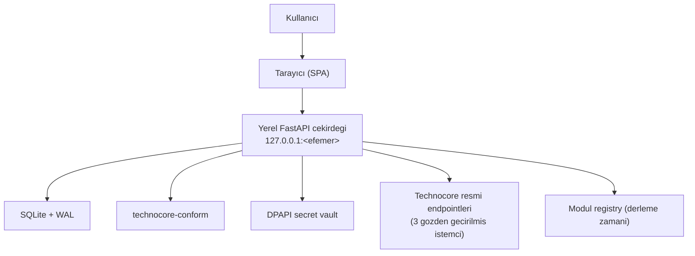
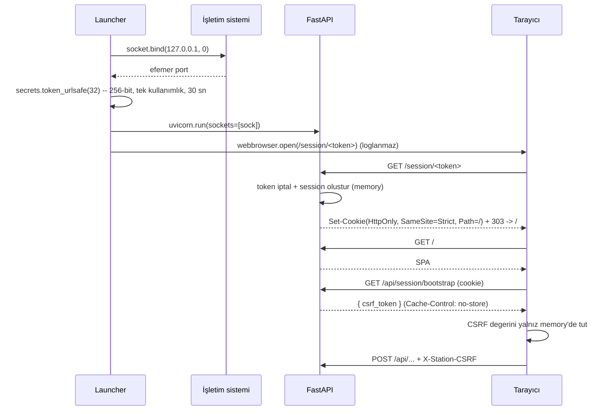

# Mimari — Technocore Station

> Ana karar kaynağı: [`../Technocore-Station-Proje-Kunyesi.md`](../Technocore-Station-Proje-Kunyesi.md) §11–12.
> Bu belge künyeyi tekrar etmez; **uygulanan** mimariyi ve paket sınırlarını tarif eder.

Durum: **Aşama 6 — proje/görev modülü temeli (Paket F)** uygulandı.

Bu satır uzun süre yanlıştı: belge "Conformance, Technocore istemcisi ve
Evidence katmanları henüz **yoktur**" diyordu, oysa üçü de yazılmış ve merge
edilmişti. Paket F bir modül **sınırı** paketi olduğu için mimari belgesinin
gerçeğe uymaması kabul edilemezdi; ADR-0004 §10 bunu düzeltmeyi kapsamın
parçası yaptı.

Uygulanan paketler ve hangi aşamada geldikleri:

| Paket | Aşama | Sorumluluk |
|---|---|---|
| `station_api/vault/` | 2 | DPAPI kasası, Windows ACL, Argon2id+ChaCha20 iç katman |
| `station_api/recovery/` | 2 | `.tcrec` v1 biçimi |
| `station_api/identity/` | 2 | Yaşam döngüsü servisi ve merkezî write gate |
| `station_api/cli/` | 2 | Yerel seed import (HTTP dışı) |
| `technocore_conform/` | 2B | sweep, canonical, `did:key`, imza/doğrulama, self-test |
| `station_api/conformance/` | 2B | Runtime self-test verdicti (process içinde tek örnek) |
| `station_api/technocore/` | 3–5 | Kapalı kaynak registry'leri ve **üç** giden istemci |
| `station_api/compose/` | 4 | Üç adımlı onay zinciri, monoton nonce, signer |
| `station_api/evidence/` | 5 | Kanıt kayıtları, yakalama, HMAC audit zinciri, dışa aktarım |
| `station_api/modules/` | 6 | **Derleme zamanı modül registry'si** ve dört alanlı kanıt sözlüğü |
| `station_api/tasks/` | 6 | Görev kayıtları, dokuz durumlu makine, salt-okuma uzlaştırma |

**Secret sınırı:** `station_api/vault/` paketini yalnız `identity` servisi,
`compose/signer.py`, `evidence` zarfı ve CLI import eder. Gelecekteki bir
LLM/model adaptörü bu paketi import edemez; sınır paket sınırıdır. Paket F'in
iki yeni paketi de bu sınıra **dokunmaz** ve bir test bunu doğrular.

---

## 1. Yüksek seviye görünüm



Bütün oklar **uygulanmış** bağlantılardır. Technocore'a giden ok yalnız
kullanıcı istediğinde kullanılır: uygulama açılışta hiçbir istek atmaz ve
başlangıçtaki uzlaştırma taraması yalnızca yerel veritabanını okur.

---

## 2. Depo yerleşimi

Bu depo kökü monorepo köküdür (`technocore-station`). Proje künyesi kökte
durur ve tüm belgeler ona göreli referans verir.

```text
.
├── apps/
│   ├── station-web/              # React 19 + Vite + TS strict + HeroUI v3
│   └── station-api/              # FastAPI, launcher, session, DB
├── packages/
│   └── technocore-conform/       # sweep/canonical/DID/sign/verify (uygulandi)
├── tests/
│   ├── conformance/              # Diferansiyel + property testler (pinli oracle)
│   ├── security/                 # Guvenlik regresyon testleri
│   └── integration/              # Yerel uctan uca testler
├── vendor/technocore-reference/  # Pinlenmis Apache-2.0 test oracle
├── docs/
├── AGENTS.md, CLAUDE.md, PROJECT_STATUS.md, SECURITY.md
├── LICENSE (MIT), NOTICE (lisans haritasi), README.md
└── Technocore-Station-Proje-Kunyesi.md
```

---

## 3. Paket sınırları

Sınırlar **tek yönlüdür**. Ok yönünün tersine import yasaktır.

```text
station-web  ──HTTP(aynı origin)──▶  station-api  ──▶  technocore-conform
                                          │
                                          ├──▶  SQLite (sqlalchemy)
                                          └──▶  Windows DPAPI (Asama 2)
```

### `apps/station-web`
- **Yalnız** sunum ve kullanıcı etkileşimi.
- Seed, private key, sweep, canonical veya imza **hesaplamaz**.
- Backend'den gelen hazır veriyi gösterir.
- **Hardcoded backend portu veya Technocore endpoint'i içermez.**
  Tüm çağrılar göreli (`/api/...`) yapılır.
- Secret için kalıcı tarayıcı depolaması (`localStorage`,
  `sessionStorage`, `IndexedDB`) **kullanmaz**.

### `apps/station-api`
- Launcher, oturum ve CSRF yönetimi.
- SQLite erişimi ve migration (`0001`…`0007`, tek head).
- DPAPI vault, recovery, kanıt defteri ve HMAC audit zinciri.
- Technocore HTTP istemcileri ve merkezî write gate.
- Derleme zamanı modül registry'si ve görev katmanı.
- Canonical hesap için `technocore-conform` kullanır — kendi içinde
  kripto/canonical kuralı **uygulamaz**.

### `packages/technocore-conform`
- Platform ve FastAPI'den **bağımsız** saf Python paketi.
- `station-api`, SQLite, FastAPI, Windows veya **ağ** modülü **import etmez**.
- Resmî kodu **kopyalamadan** spesifikasyonu uygular (MIT).
- **Aşama 2B'de protokol yüzeyi uygulandı:** sweep, isim/nonce doğrulama,
  canonical string, `did:key`, Ed25519 imzalama/doğrulama, runtime self-test
  ve `technocore-conform` CLI'ı. Tek runtime bağımlılığı `cryptography`.
- Import anında **yan etkisi yoktur**: disk okumaz, self-test çalıştırmaz.
- Self-test vektörleri paket verisi olarak gelir; `vendor/` dizinine
  **production runtime'da ihtiyaç duymaz**.
- Ayrıntı: [`conformance.md`](conformance.md).

### `station_api/technocore` (Aşama 3–5)
- Uygulamanın **tek giden istek yüzeyi**.
- Üç kapalı registry: `sources.py` (altı resmî belge), `write_targets.py`
  (mesaj lane'i, `DENIED_ROOMS`), `evidence_targets.py` (export lane'i).
  İstemciler URL değil registry kimliği alır.
- `client.py` TLS zorunlu, redirect kapalı, faz bazlı timeout, decompress
  edilmiş bayt üzerinde boyut sınırı, sınırlı retry.
- `write_client.py` ve `evidence_client.py` ayrı modüllerdir çünkü hata
  politikaları zıttır; okuma retry eder, yazma **asla** etmez (IMP-277).
- `projection.py` kritik protokol alanlarını canlı belgelerle karşılaştırır.
- `service.py` verdict'i **process içinde** tutar; her açılışta
  `never_checked` başlar ve otomatik istek atmaz.
- Ayrıntı: [`read-only-technocore.md`](read-only-technocore.md).

### `station_api/compose` ve `station_api/evidence` (Aşama 4–5)
- `compose/` üç adımlı onay zincirini ve monoton nonce sayacını sahiplenir;
  giden yazma istemcisinin **tek çağıranıdır**. Write gate her adımda
  yeniden koşar.
- `evidence/` gönderimleri arşivler, export lane'inden salt-okuma yakalama
  yapar, dört güven seviyesini ayrı tutar ve ayrı DPAPI zarfındaki
  materyalle HMAC audit zinciri tutar. Budanmaz.
- Ayrıntı: [`evidence-model.md`](evidence-model.md).

### `station_api/modules` ve `station_api/tasks` (Aşama 6)
- `modules/` **derleme zamanında sabit** bir kayıt kümesidir. Diskten
  plugin/import yükleme yoktur ve bir test bunu sözdizim ağacı taramasıyla
  sabitler (künye ADR-017). Proje 0 **taşınmadı**; kayıt sahibi olan modüllere
  işaret eder.
- `tasks/` görev kayıtlarını, dokuz durumlu makineyi (üçü bu sürümde
  üretilemez) ve salt-okuma başlangıç uzlaştırmasını sahiplenir.
- İkisi de **giden yüzey açmaz**, kasaya/signer'a dokunmaz ve ikinci bir gate
  kurmaz; görev kapısı `write_gate`'in `CheckState`'ini yeniden kullanır.
- Bu sürümde **görünür yüzeyleri yoktur**: görev route'u yok, `tasks` bölümü
  `ready: false`.
- Ayrıntı: [`task-modules.md`](task-modules.md).

### `vendor/technocore-reference`
- Pinlenmiş resmî commit, **yalnız test oracle'ı** (Apache-2.0).
- Uygulama runtime paketine **girmez**; hiçbir `apps/` veya `packages/`
  modülü buradan import etmez.
- Bkz. [`../vendor/technocore-reference/PROVENANCE.md`](../vendor/technocore-reference/PROVENANCE.md).

---

## 4. Same-origin başlatma modeli (uygulandı)



Token ve session **yalnız process memory**'dedir; diske yazılmaz, process
kapanınca kaybolur.

### Middleware zinciri

Dıştan içe (Starlette'de son eklenen en dıştadır):

| # | Katman | Görevi | Hata |
|---:|---|---|---|
| 1 | `SecurityHeadersMiddleware` | CSP + sertleştirme başlıkları, `no-store` | — |
| 2 | `HostGuardMiddleware` | `Host` tam olarak `127.0.0.1:<port>` | **421** |
| 3 | `FetchMetadataMiddleware` | `Origin` / `Sec-Fetch-Site` | **403** |
| 4 | `SessionMiddleware` | Cookie → `request.state.session` (zorlamaz) | — |
| 5 | `CsrfMiddleware` | State-changing istekte `X-Station-CSRF` | **403** |
| 6 | Route dependency `require_session` | Korumalı endpoint'te oturum | **401** |

`SecurityHeadersMiddleware` en dıştadır; böylece 421/403 hata yanıtları da
sertleştirme başlıklarını taşır.

### Development farkı
- Vite **yalnız `127.0.0.1`** üzerinde çalışır ve `/api`, `/session`
  yollarını backend'e proxy eder (`changeOrigin: true`, böylece `Host`
  doğru kalır).
- Tarayıcı backend'e **doğrudan cross-origin istek göndermez**.
- `STATION_DEV` **varsayılan kapalı** ve **fail-closed**'dır. Yalnız açıkken
  Vite origin'i ek olarak kabul edilir. Production'da dev origin **reddedilir**.
- **CORS middleware hiçbir modda eklenmez.**

---

## 5. Veri katmanı

- SQLite, **WAL** journal mode, `foreign_keys=ON`.
- Production veri dizini: `%LOCALAPPDATA%\TechnocoreStation\`
  (`STATION_DATA_DIR` ile geçersiz kılınabilir; testler geçici dizin kullanır).
- **Veritabanı yolu frontend'e dönmez.**
- Migration: Alembic, `version_table="schema_migrations"`. Sıra
  `down_revision` zinciriyle **deterministik**, `upgrade head` **idempotent**.
- Tablolar (`0001`…`0007`): `schema_migrations`, `app_metadata`, `identity`,
  `secret_metadata`, `recovery_record`, `manifest_check`,
  `official_source_snapshot`, `message_nonce_reservation`, `evidence_record`,
  `audit_event`, `audit_chain_metadata`, `task_record`,
  `task_evidence_outcome`, `task_state_transition`.
- **Hiçbir tabloda seed veya secret alanı yoktur.** Görev tablolarında bu
  denetim `key` parçasını da kapsar.
- Migration `0007` yalnız ekleme yapar: hiçbir mevcut tablo adı, sütun veya
  kayıt kimliği değişmedi.

### Başlangıçta ne olur, ne olmaz

Uygulama kurulurken migration'lar koşar, kanıt zinciri açılmaya çalışılır ve
**salt-okuma** bir uzlaştırma taraması yarım kalmış gönderimleri listeler.
Bunların hiçbiri dışarıya istek göndermez: açılışta giden istek sayısı
**sıfırdır** ve bir test bunu sayarak ölçer.

---

## 6. Bu sürümde bilinçli olarak yapılmayanlar

- ~~**Görünür görev yüzeyi.**~~ **Kapandı:** görev katmanının HTTP
  route'ları H1/H2'de açıldı ve `work-scan` / `tasks` / `activity`
  bölümlerinin üçü de artık `ready: true`. Bu madde Paket F'in
  durumunu anlatıyordu (ADR-0004 §9).
- ~~**Öneri üreticisi ve yürütücü.**~~ **Kapandı:** `suggested`'ı H1,
  `running`/`paused`'ı H2'nin deterministik yürütücüsü üretilebilir yaptı;
  `UNPRODUCIBLE_STATES` bugün boştur (ADR-0007, ADR-0008 §3).
- ~~**Dış paylaşım.**~~ **Kapandı:** dördüncü kanıt alanı H3'te
  doldurulabilir oldu. Yalnız **arşivlenmiş bir gönderimin kanıt kaydı
  kimliğiyle**: `EvidenceRef` yapıcısı şekli, `TaskService.record_evidence`
  satırın varlığını denetler ve `verified` o gönderimin kendi sonucundan
  gelir. Alan `PUBLICATION_FIELDS`'e **girmedi** — yayımlamadan da bir görev
  tamamlanabilir (ADR-0004 §4, ADR-0009 §1).
- **Bütçe.** Bütçe alanı açılmadı ve bütçe varmış gibi davranılmıyor;
  erteleme [`task-modules.md`](task-modules.md) §6'da kayıtlıdır
  (ADR-0004 §7).
- **Kanıt kaydı silme route'u.** ADR-0003 §7'nin bu yarısı ertelendi
  (IMP-329).
- **Note lane, room explorer, çoklu DID, paketleme/installer.** Bkz.
  [`../PROJECT_STATUS.md`](../PROJECT_STATUS.md).
