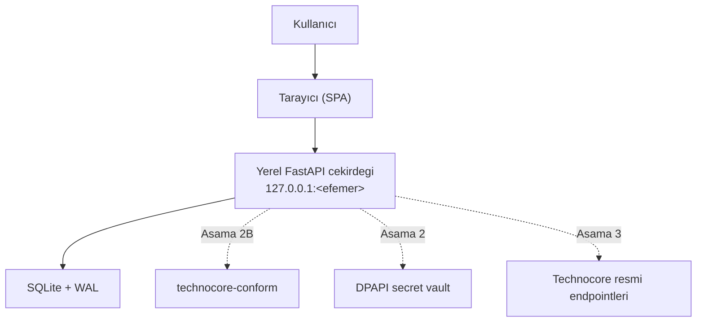
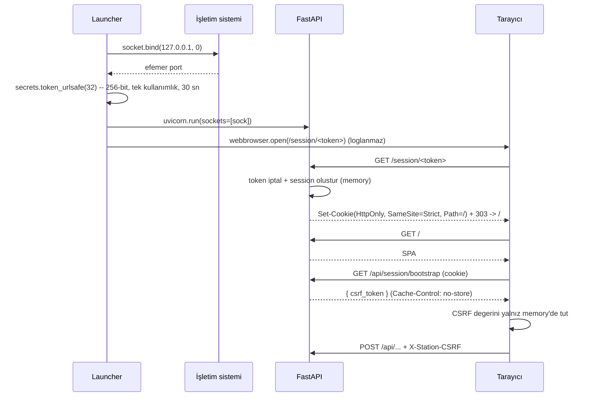

# Mimari — Technocore Station

> Ana karar kaynağı: [`../Technocore-Station-Proje-Kunyesi.md`](../Technocore-Station-Proje-Kunyesi.md) §11–12.
> Bu belge künyeyi tekrar etmez; **uygulanan** mimariyi ve paket sınırlarını tarif eder.

Durum: **Aşama 2 — Identity & Recovery** uygulandı. Conformance (sweep,
canonical, imza), Technocore istemcisi ve Evidence katmanları henüz
**yoktur**.

Aşama 2 ile eklenen paketler:

| Paket | Sorumluluk |
|---|---|
| `station_api/vault/` | DPAPI kasası, Windows ACL, Argon2id+ChaCha20 iç katman |
| `station_api/recovery/` | `.tcrec` v1 biçimi |
| `station_api/identity/` | Yaşam döngüsü servisi ve merkezî write gate |
| `station_api/cli/` | Yerel seed import (HTTP dışı) |
| `technocore_conform/did.py` | seed -> public key -> `did:key` ve tersi |

**Secret sınırı:** `station_api/vault/` paketini yalnız `identity` servisi ve
CLI import eder. Gelecekteki bir LLM/model adaptörü bu paketi import
edemez; sınır paket sınırıdır.

---

## 1. Yüksek seviye görünüm



Kesikli oklar **henüz uygulanmamış** bağlantılardır.

---

## 2. Depo yerleşimi

Bu depo kökü monorepo köküdür (`technocore-station`). Proje künyesi kökte
durur ve tüm belgeler ona göreli referans verir.

```text
.
├── apps/
│   ├── station-web/              # React 19 + Vite + TS strict + HeroUI v3
│   └── station-api/              # FastAPI, launcher, session, DB
├── packages/
│   └── technocore-conform/       # (Asama 2B) sweep/canonical/DID/sign/verify
├── tests/
│   ├── conformance/              # (Asama 2B) diferansiyel + property testler
│   ├── security/                 # Guvenlik regresyon testleri
│   └── integration/              # Yerel uctan uca testler
├── vendor/technocore-reference/  # Pinlenmis Apache-2.0 test oracle
├── docs/
├── AGENTS.md, CLAUDE.md, PROJECT_STATUS.md, SECURITY.md
├── LICENSE (MIT), NOTICE (lisans haritasi), README.md
└── Technocore-Station-Proje-Kunyesi.md
```

---

## 3. Paket sınırları

Sınırlar **tek yönlüdür**. Ok yönünün tersine import yasaktır.

```text
station-web  ──HTTP(aynı origin)──▶  station-api  ──▶  technocore-conform
                                          │
                                          ├──▶  SQLite (sqlalchemy)
                                          └──▶  Windows DPAPI (Asama 2)
```

### `apps/station-web`
- **Yalnız** sunum ve kullanıcı etkileşimi.
- Seed, private key, sweep, canonical veya imza **hesaplamaz**.
- Backend'den gelen hazır veriyi gösterir.
- **Hardcoded backend portu veya Technocore endpoint'i içermez.**
  Tüm çağrılar göreli (`/api/...`) yapılır.
- Secret için kalıcı tarayıcı depolaması (`localStorage`,
  `sessionStorage`, `IndexedDB`) **kullanmaz**.

### `apps/station-api`
- Launcher, oturum ve CSRF yönetimi.
- SQLite erişimi ve migration.
- (Aşama 2) DPAPI vault, recovery, audit.
- (Aşama 3) Technocore HTTP istemcisi ve write gate'leri.
- Canonical hesap için `technocore-conform` kullanır — kendi içinde
  kripto/canonical kuralı **uygulamaz**.

### `packages/technocore-conform`
- Platform ve FastAPI'den **bağımsız** saf Python paketi.
- `station-api`, SQLite, FastAPI veya Windows modülü **import etmez**.
- Resmî kodu **kopyalamadan** spesifikasyonu uygular (MIT).
- **Aşama 1'de yalnız paket sınırı + placeholder dokümantasyonudur.**
  Sweep, DID veya imza kodu henüz yoktur.

### `vendor/technocore-reference`
- Pinlenmiş resmî commit, **yalnız test oracle'ı** (Apache-2.0).
- Uygulama runtime paketine **girmez**; hiçbir `apps/` veya `packages/`
  modülü buradan import etmez.
- Bkz. [`../vendor/technocore-reference/PROVENANCE.md`](../vendor/technocore-reference/PROVENANCE.md).

---

## 4. Same-origin başlatma modeli (uygulandı)



Token ve session **yalnız process memory**'dedir; diske yazılmaz, process
kapanınca kaybolur.

### Middleware zinciri

Dıştan içe (Starlette'de son eklenen en dıştadır):

| # | Katman | Görevi | Hata |
|---:|---|---|---|
| 1 | `SecurityHeadersMiddleware` | CSP + sertleştirme başlıkları, `no-store` | — |
| 2 | `HostGuardMiddleware` | `Host` tam olarak `127.0.0.1:<port>` | **421** |
| 3 | `FetchMetadataMiddleware` | `Origin` / `Sec-Fetch-Site` | **403** |
| 4 | `SessionMiddleware` | Cookie → `request.state.session` (zorlamaz) | — |
| 5 | `CsrfMiddleware` | State-changing istekte `X-Station-CSRF` | **403** |
| 6 | Route dependency `require_session` | Korumalı endpoint'te oturum | **401** |

`SecurityHeadersMiddleware` en dıştadır; böylece 421/403 hata yanıtları da
sertleştirme başlıklarını taşır.

### Development farkı
- Vite **yalnız `127.0.0.1`** üzerinde çalışır ve `/api`, `/session`
  yollarını backend'e proxy eder (`changeOrigin: true`, böylece `Host`
  doğru kalır).
- Tarayıcı backend'e **doğrudan cross-origin istek göndermez**.
- `STATION_DEV` **varsayılan kapalı** ve **fail-closed**'dır. Yalnız açıkken
  Vite origin'i ek olarak kabul edilir. Production'da dev origin **reddedilir**.
- **CORS middleware hiçbir modda eklenmez.**

---

## 5. Veri katmanı

- SQLite, **WAL** journal mode, `foreign_keys=ON`.
- Production veri dizini: `%LOCALAPPDATA%\TechnocoreStation\`
  (`STATION_DATA_DIR` ile geçersiz kılınabilir; testler geçici dizin kullanır).
- **Veritabanı yolu frontend'e dönmez.**
- Migration: Alembic, `version_table="schema_migrations"`. Sıra
  `down_revision` zinciriyle **deterministik**, `upgrade head` **idempotent**.
- Aşama 1 tabloları: `schema_migrations` (Alembic ledger) ve `app_metadata`.
- **Hiçbir tabloda seed veya secret alanı yoktur.**

---

## 6. Bu aşamada bilinçli olarak yapılmayanlar

Identity/seed/recovery/signing endpoint'i, Technocore network istemcisi,
Evidence kayıtları, sweep/canonical/DID kodu, room explorer, çoklu DID,
paketleme/installer. Bunlar Aşama 2+ konularıdır; bkz.
[`../PROJECT_STATUS.md`](../PROJECT_STATUS.md).
