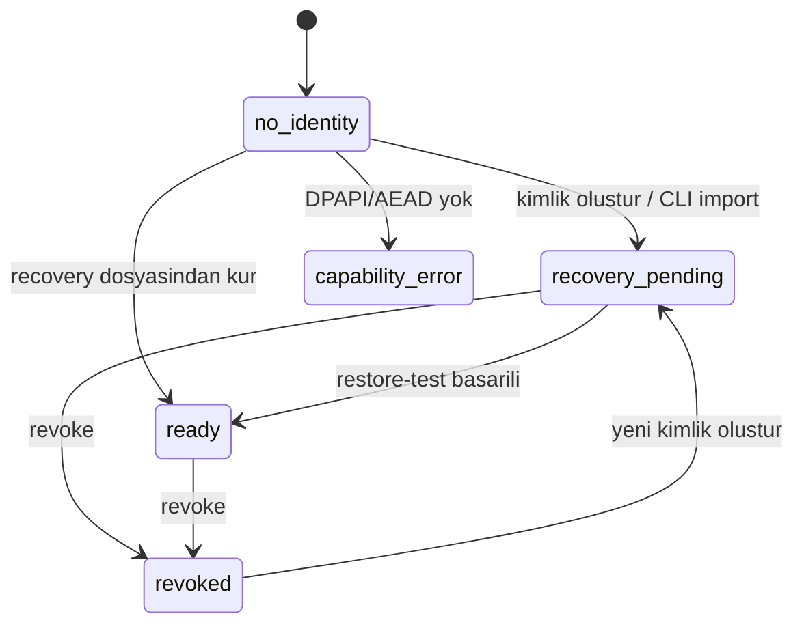

# Kimlik yaşam döngüsü

> Uygulama: [`../apps/station-api/src/station_api/identity/`](../apps/station-api/src/station_api/identity/)
> Ana karar kaynağı: [`../Technocore-Station-Proje-Kunyesi.md`](../Technocore-Station-Proje-Kunyesi.md) §13
> İlgili: [`recovery-format-v1.md`](recovery-format-v1.md) · [`threat-model.md`](threat-model.md)

## 1. Durum makinesi



| Durum | Anlamı | Dış yazma |
|---|---|---|
| `no_identity` | Bu bilgisayarda kimlik yok | kapalı |
| `creating` | Geçiş durumu (DB satırı var, kasa yazılıyor) | kapalı |
| `recovery_pending` | Kimlik var, restore-test yapılmadı | **kapalı** |
| `ready` | Restore-test başarılı | kimlik tarafı geçti, yine de kapalı (bkz. §5) |
| `revoked` | Kasa zarfı silindi | kapalı |
| `capability_error` | DPAPI veya AEAD kullanılamıyor | kapalı |

**Tek aktif kimlik** kuralı hem servis katmanında hem veritabanında
uygulanır: `identity.active_slot` nullable UNIQUE bir sütundur, aktifken `1`,
revoke edilince `NULL` olur. SQLite NULL'ları eşit saymadığı için bu
"en fazla bir aktif kimlik" kısıtını şemanın kendisine yazar.

---

## 2. Seed üretimi

Seed **yalnız** `secrets.token_bytes(32)` ile üretilir. Başka hiçbir kaynak
yoktur: paroladan türetme yok, kullanıcı entropisi yok, sayaç yok.

Paroladan seed türetme (resmî `sign.py` içindeki SHA-256 yolu) **bilerek
uygulanmamıştır**: 32 baytlık rastgeleliği, parolanın sahip olduğu entropiyle
değiştirir.

---

## 3. Koruma modları

| Mod | Katmanlar | Öneri |
|---|---|---|
| `dpapi` | Windows DPAPI (current-user) | risk onayı ister |
| `dpapi+passphrase` | Argon2id + ChaCha20-Poly1305, sonra DPAPI | **varsayılan** |

Parola katmanı DPAPI zarfının **içindedir**. Dosyayı başka makineye kopyalayan
biri DPAPI nedeniyle hiçbir şey elde edemez; bu Windows kullanıcısı olarak
çalışan biri ise Argon2id ile karşılaşır.

**Parola ne zaman sorulur?** Uygulama açılışında değil, yalnız secret kullanan
işlemlerde: recovery dosyası üretimi ve (Aşama 4'te) imzalama. Salt okunur
kullanımda sürtünme yoktur.

Parola politikası: **en az 16 karakter**, en fazla 1024 UTF-8 baytı. Yapay
büyük/küçük/sembol kuralı yoktur — bu kurallar tahmin edilebilir kalıplara
iter ve gerçek entropiyi artırmaz.

---

## 4. Akışlar

### 4.1 Yeni kimlik oluşturma
1. Kullanıcı koruma modunu seçer (varsayılan `dpapi+passphrase`).
2. Yalnız DPAPI seçilirse **açık risk onayı** istenir.
3. Parola iki kez girilir.
4. Kullanıcı tam olarak **`KİMLİK OLUŞTUR`** metnini yazar.
5. Seed üretilir, DID/public key/fingerprint türetilir.
6. `Identity` satırı `creating` olarak yazılır (tek-aktif kısıtı burada uygulanır).
7. Kasa **atomik** olarak yazılır: temp dosya, ACL, `os.replace`, ACL.
8. `SecretMetadata` yazılır, durum `recovery_pending` olur.
9. Herhangi bir adım başarısız olursa **iki taraf da geri alınır**: kasa
   dosyası silinir, `Identity` satırı silinir. Orphan kalmaz.

Başarıdan sonra gösterilen: **yalnız** public DID, public fingerprint, koruma
modu, durum ve tarih. Seed hiçbir zaman gösterilmez veya indirilemez.

### 4.2 Recovery oluşturma
Ayrı, açık bir kullanıcı eylemidir. Gerekirse kasa parolası, ayrıca recovery
parolası (iki kez) istenir. Seed yalnız işlem süresince açılır. Yanıt
**yalnızca şifreli dosyadır**; `Content-Disposition: attachment` ve
`Cache-Control: no-store` taşır. Frontend Blob'u indirir ve hemen bırakır.

DB'ye yalnız dosyanın SHA-256'sı ve KDF metadata'sı yazılır.

**Recovery üretilmiş olması yeterli değildir**; kimlik hâlâ
`recovery_pending`tir.

### 4.3 Restore-test
Yalnız şifreli `.tcrec` ve recovery parolası alınır — raw seed alınmaz.
Dosyadan seed çözülür, DID yeniden türetilir ve **üç yönlü** karşılaştırılır:
türetilen DID = header DID = kurulu DID.

Test **kasaya dokunmaz** ve kurulu seed'i değiştirmez. Başarısızlıkta
**hiçbir şey değişmez**. Başarıda yalnız `recovery_verified_at`,
`RecoveryRecord.verified_at` ve durum (`ready`) güncellenir.

### 4.4 Temiz profilden kurtarma
Kimlik bulunmayan bir profilde:
1. Dosya ve parola ile **inspect** yapılır; kullanıcıya yalnız public DID ve
   fingerprint gösterilir. Hiçbir şey yazılmaz.
2. Kullanıcı bu DID'i onaylar.
3. Kullanıcı yeni koruma modunu seçer.
4. Seed yeni profilin DPAPI kasasına yazılır ve recovery **doğrulanmış**
   sayılır — dosyayı açabilmek zaten restore-testin kendisidir.

Eski DPAPI kasasına veya eski Windows profiline **hiçbir bağımlılık yoktur**.

> **Dürüst kapsam:** Otomatik test bunu *aynı Windows hesabı içinde bağımsız
> bir veri kökü* ile doğrular. **Farklı bir Windows hesabında test
> edilmemiştir.** Bkz. `PROJECT_STATUS.md`.

### 4.5 Mevcut resmî seed importu (yalnız CLI)
Web arayüzünde raw seed alanı **yoktur** ve HTTP üzerinden seed kabul eden
endpoint **yoktur**. Import yalnız yerel CLI ile yapılır:

```bash
uv run --project apps/station-api python -m station_api.cli import-seed --file <yol>
```

- Kabul edilen tek biçim: **64 hex karakter** (bare veya `keygen` çıktısındaki
  `seed: <hex>` satırı). Paroladan türetme reddedilir.
- Seed ve parola **komut satırı argümanı değildir**; parolalar `getpass` ile alınır.
- Tam onay metni istenir.
- Başarıda yalnız DID ve fingerprint yazdırılır.
- Dosya yolu, seed ve parola **loglanmaz**.
- Aktif kimlik varsa işlem reddedilir.
- Kaynak dosya **değiştirilmez ve silinmez**.

### 4.6 Revoke
Kullanıcı **tam DID'i yazarak** onaylar. Kasa zarfı silinir, metadata
`revoked` olur, `active_slot` boşalır.

UI açıkça söyler: bu bir **güvenli disk silme değildir** ve **mevcut recovery
dosyaları geçerli kalmaya devam eder**.

---

## 5. Write gate

Merkezî `WriteGate` (`identity/write_gate.py`) saf bir fonksiyondur ve tüm dış
yazmaların tek kapısıdır. Override bayrağı, ortam değişkeni veya debug
bypass'ı **yoktur**.

| Kontrol | Aşama | Bugün |
|---|---:|---|
| `identity_present` | 2 | uygulanıyor |
| `identity_not_revoked` | 2 | uygulanıyor |
| `vault_present` | 2 | uygulanıyor |
| `recovery_verified` | 2 | uygulanıyor |
| `conformance_verified` | 4 | **`not_implemented`** |
| `manifest_current` | 4 | **`not_implemented`** |

Uygulanmamış bir gereksinim **asla geçmiş sayılmaz**. Bu yüzden tamamen
kurtarılmış bir kimlikte bile `allowed = False` döner: doğrulanmış bir
canonicalization motoru olmadan imza üretmek, sunucunun sakladığı baytlarla
eşleşmeyen bir kayıt üretebilir.

`identity_ready` alanı Aşama 2 yarısının tamamlandığını ayrıca bildirir.

---

## 6. Bellek sınırı (dürüst beyan)

Seed, işlem süresince `bytearray` olarak tutulur ve kullanım sonrası
sıfırlanır. **Bu bir garanti değildir.** CPython değeri tahsis sırasında veya
çöp toplama sırasında kopyalamış olabilir ve Python'da belleği güvenilir
biçimde silmenin taşınabilir bir yolu yoktur. Süreç belleğini okuyabilen bir
saldırgan kapsam dışıdır.
